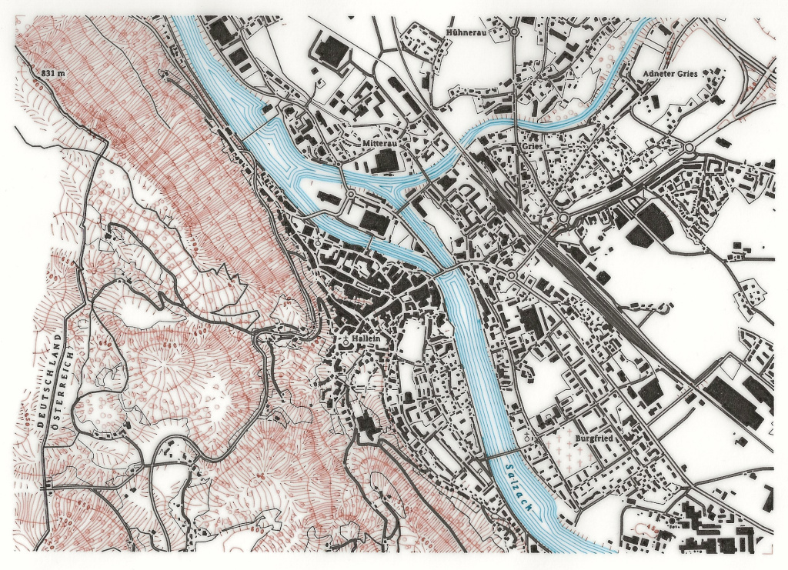

# PENPLOTTER.01

This is a free-time project that i have been working on for a while.

Intent is to use the low-cost Arduino CNC-shield in combination with an Arduino R4 WiFi, rather than the typical "Arduino R3 / GRBL" combination. I will try to take inspiration from GRBL and FluidNC and produce generic code suitable for my machine rather than a generic framework.

Currently the repo is mostly for backup purposes, but as the state of the project moves towards complete it may also be helpful to others.

## Sideproject to produce content for the plotter

# [Hachure - Hillshade](pp_hachure/README.md)

An algorithm to generate hachure lines over a portion of a DEM elevation raster.

# [Vector Tile parser for map content](pp_oldmap/README.md)

Loads and prepares content in a specific map style for pen plotter output.

