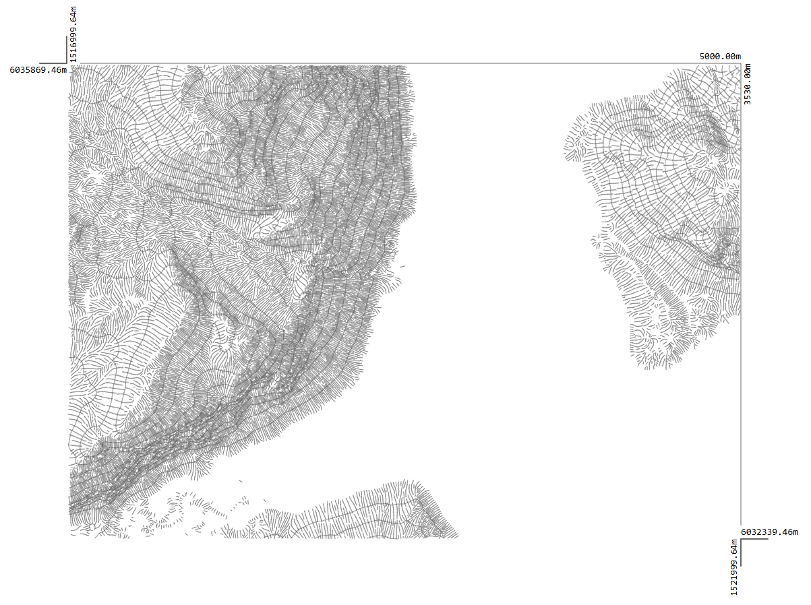
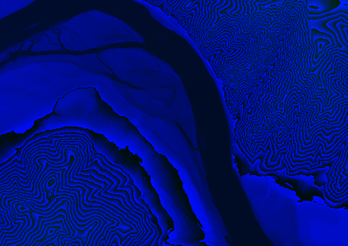

# Hachure - Hillshade

## This repository provides an algorithm to generate hachure lines over a portion of a DEM elevation raster

The application runs as a web-application in a browser. Currently no measures have been taken to put code into i.e. web-workers,
therefore user experience is suboptimal at this time. It would be a big improvement and should be fairly easy to implement to
run each contour increment in a web-worker, as such keeping the application responsive and also clarifying the code.

### example output

### illustration of how it works

### Simple description of the steps performed to build hachure lines:

- Load a specially prepared DEM raster.
- Build contour lines in defined intervals on top the DEM raster using the [d3-contour](https://d3js.org/d3-contour) library.
- Prepare each contour for further processing, i.e. calculating aspect, slope and hollshade at specific points along individual contour lines.
- Starting with the lowest contour and iterating upwards in height.
  - Start new hachure lines where there is enough space along the contour. The lowermost contour will be empty initially and is populated with an initial set of hachure lines. The hachure lines will have zero length initially and only hold information about the aspect aka the upward direction
    at the specifice position.
  - The upward vectors of each hachure are checked for intersection with the next contour line. With the vectors limited to a configurable length, this
    effectively checks for slope. When an intersection is found, it means that the slope is steep enough to draw a hachure.
  - When hachure lines get too close to each other, some lines will be marked as complete and dont get continued.

As the algorithm works its way upward from contour to contour hachure lines are either discarded, continued, or new hachure lines are started.
The calculation is resilient at contour ends, as hachure lines will discontinued, when no further intersecions are found.

### scaled-length

An important part of the hachure display are denser lines in specific areas, i.e. on the shadow side of hills.

To achieve this contours are split into segments of equal length initially. At each vertex resulting from the split operation, aspect and slope is calculated. Aspect and slope are then used to calculate a hillshade value as described in [how-hillshade-works](https://pro.arcgis.com/en/pro-app/latest/tool-reference/3d-analyst/how-hillshade-works.htm). Instead of hillshade, aspect only could also be used, but hillshade appeared to yield better results. The hillshade value is then mapped to a scaled-length value. For a dark hillshade value (lower value) a bigger scaled length is calculated and stored on the vertex. A bigger scaled length value means that the contour can accept more hachure lines around this vertex.

### DEM raster format

Due to the inability of browsers to load images in formats other than 32 bit RGB i decided to go with a 16 bit unsigned int format for the DEM rasters.
The lower 8 bits are written to the blue channel, the higher 8 bits are written to the green channel. The resulting images are hard to read, but after loading the
image its full 16 bits are restored.

