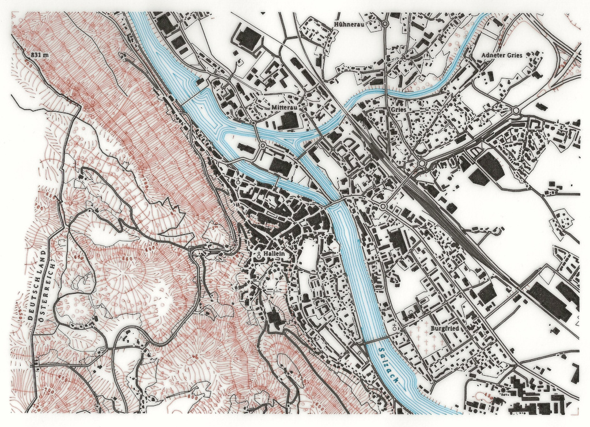
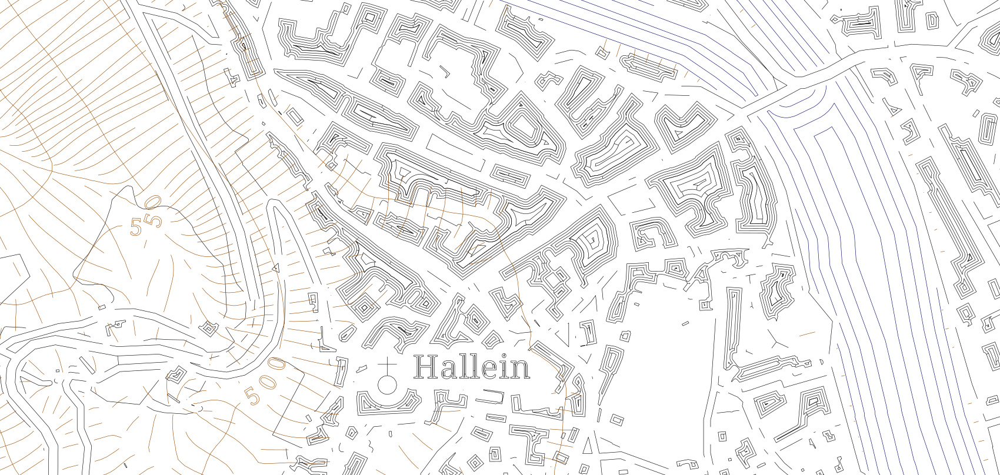

# Load and parse a Vector Tile Basemap for output on a pen plotter

This is a free time project to see how far map output can be taken on my pen-plotter.

Maps currently have two datasources:

- The Austrian [basemap.at Vektor](https://basemap.at/standard-5/) Vector Tiles for topographic map content.
- The open data DEM raster in 10m resolution [Digitales Geländemodell (DGM) Österreich](https://www.data.gv.at/katalog/dataset/land-ktn_digitales-gelandemodell-dgm-osterreich) for contour and hachure like terrain display.

### example output

# output for pen plotter

Transforming all content to a format that can be output on the pen plotter can be challenging. This applied especially to an
filling strategy of buiding areas and a hachure style hillshade.

